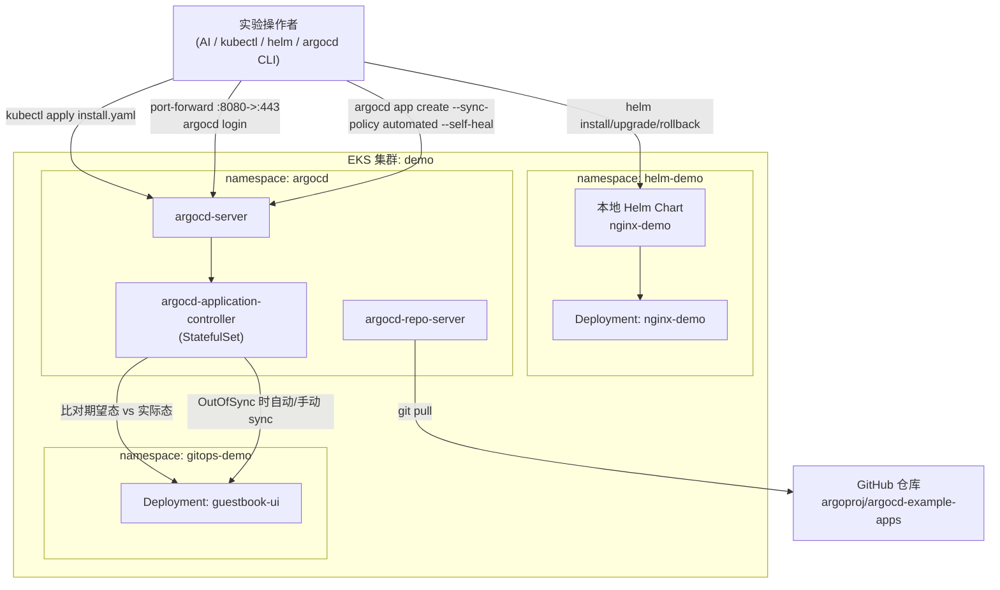
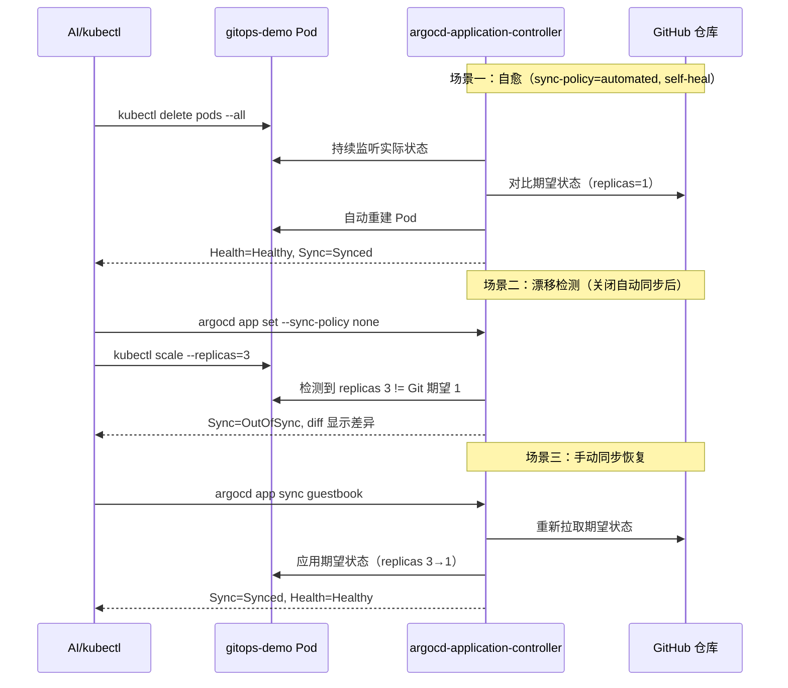
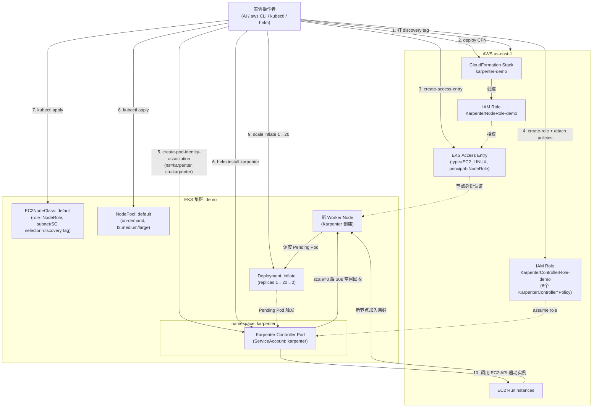
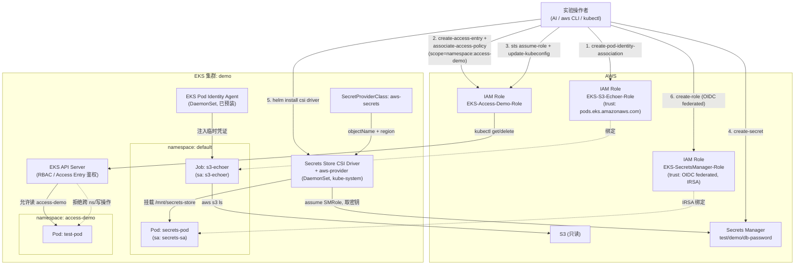

# 架构文档

本仓库包含 18 个 Demo，这里不做全量架构图汇总，只对其中组件交互较复杂、值得可视化的 Demo 提供架构图；其余 Demo 请直接看对应的 `docs/demoXX-*.md`。

选取标准：组件数量多、涉及跨服务编排（IAM/CloudFormation/Kubernetes 资源联动）、或存在清晰的多步骤调用时序。据此选出 4 个 Demo：**Demo06（Helm + Argo CD GitOps）**、**Demo09（Karpenter 节点自动伸缩）**、**Demo11（CSI 多驱动有状态存储）**、**Demo12（身份与访问控制三件套）**。

---

## Demo06 — Helm 与 GitOps 发布

Demo06 分两部分：先用 Helm 完成本地 Chart 的 install → upgrade → rollback 生命周期管理；再部署 Argo CD，创建一个指向 GitHub 公开仓库（`argoproj/argocd-example-apps`）的 Application，验证自动同步、自愈（删除 Pod 后自动重建）和漂移检测（手动 `kubectl scale` 后 Argo CD 标记 OutOfSync 并可一键同步回 Git 期望状态）三个 GitOps 场景。

**GitOps 自愈与漂移检测时序**（体现 Argo CD 的核心价值，而非静态拓扑）：

---

## Demo09 — Karpenter 节点自动伸缩

Demo09 从零搭建 Karpenter：先给 VPC 子网和安全组打 `karpenter.sh/discovery` 标签，再通过 CloudFormation 创建 `KarpenterNodeRole` 并用 Access Entry（`EC2_LINUX` 类型）授权其加入集群；手动创建 `KarpenterControllerRole` 并附加 CloudFormation 生成的全部 IAM 策略，再用 Pod Identity 关联绑定给 `karpenter` ServiceAccount；最后 Helm 安装 Karpenter 控制器，创建 `EC2NodeClass`/`NodePool`，并通过扩容 `inflate` Deployment 到 20 副本触发新节点自动创建、缩容到 0 触发节点自动回收（consolidateAfter 30s）。

---

## Demo11 — 使用 CSI 部署有状态应用（EBS、EFS 与 S3）

Kubernetes 原生不提供持久化存储，需通过 CSI 驱动接入云存储。本 Demo 安装三种 AWS CSI 驱动，各自授权方式不同——EBS 用 addon 自带的 Pod Identity 自动配置权限，EFS 同样走 Pod Identity 但节点还需额外的 NFS(2049) 安全组放行，S3 Mountpoint 则不支持 Pod Identity，必须把权限直接挂到节点实例 Role 上。三者的访问模式也不同：EBS 是 ReadWriteOnce（单节点独占，适合数据库），EFS/S3 是 ReadWriteMany（多 Pod 共享）。

```mermaid
flowchart TB
  subgraph EBS["EBS CSI（块存储，ReadWriteOnce）"]
    EBSRole["IAM Role AmazonEKS_EBS_CSI_DriverRole\n(Pod Identity, AmazonEBSCSIDriverPolicy)"]
    EBSAddon["EBS CSI Addon\n(pod-identity-associations 自动配置)"]
    EBSSC["StorageClass ebs-sc (gp3)"]
    EBSPod["Pod ebs-writer\n(单节点独占写入)"]
    EBSRole --> EBSAddon --> EBSSC --> EBSPod
  end

  subgraph EFS["EFS CSI（共享文件系统，ReadWriteMany）"]
    EFSRole["IAM Role AmazonEKS_EFS_CSI_DriverRole\n(Pod Identity, AmazonEFSCSIDriverPolicy)"]
    NodeSG["节点 IAM Policy: EFS ClientMount/ClientWrite\n+ 安全组放行 NFS 2049"]
    EFSAddon["EFS CSI Addon"]
    EFSFS["EFS 文件系统 + Mount Target\n(每个私有子网一个)"]
    EFSPods["efs-writer + efs-reader\n(两个 Pod 共享同一文件)"]
    EFSRole --> EFSAddon
    NodeSG --> EFSFS
    EFSAddon --> EFSFS --> EFSPods
  end

  subgraph S3CSI["S3 Mountpoint CSI（对象存储挂载）"]
    NodeRole["节点实例 Role\n(直接附加 S3 Policy，不支持 Pod Identity)"]
    S3Addon["S3 CSI Addon"]
    S3PV["静态 PV: s3-pv\n(volumeHandle 绑定 S3 桶)"]
    S3Pod["Pod s3-writer\n(挂载 S3 桶为文件系统)"]
    NodeRole --> S3Addon --> S3PV --> S3Pod
  end
```

---

## Demo12 — 身份与访问控制

Demo12 并列实践三种独立的身份机制，共同点是都围绕"谁能以什么身份访问什么资源"：**Pod Identity** 让 Pod 直接获取 IAM 临时凭证访问 S3；**Access Entry** 把外部 IAM Role 映射为 Kubernetes RBAC 主体，并将其权限收窄到单一 namespace 的只读操作；**Secrets Store CSI Driver** 通过 IRSA（注意与 Pod Identity 是两种不同的联合身份机制）让 CSI Driver 代表 Pod 从 Secrets Manager 取密钥并挂载为文件卷。

